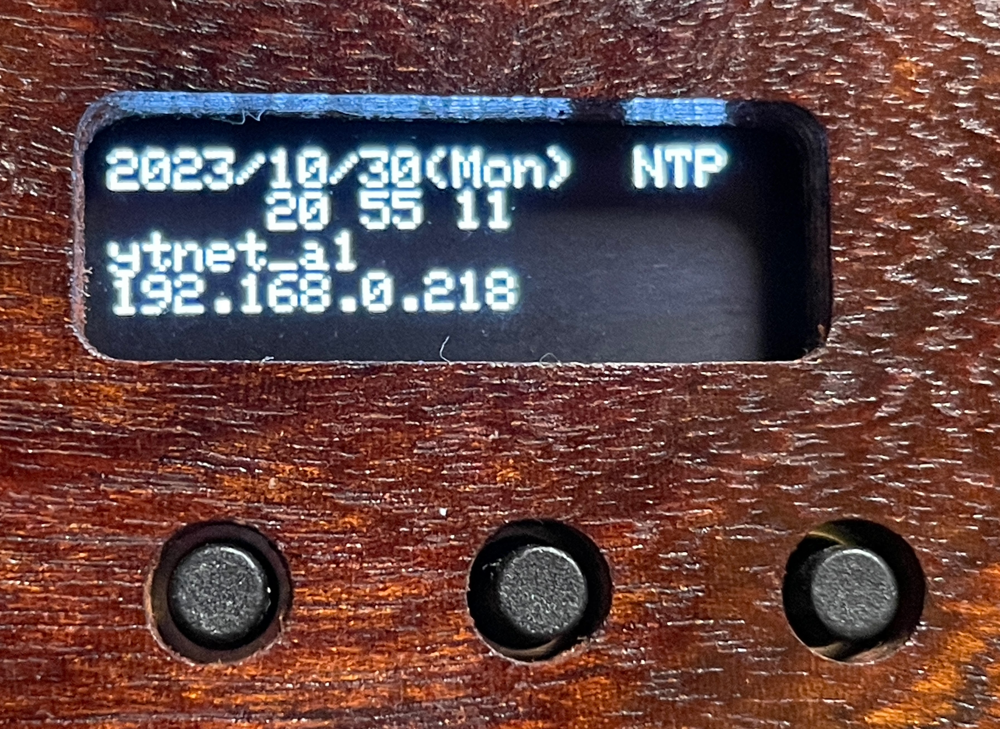
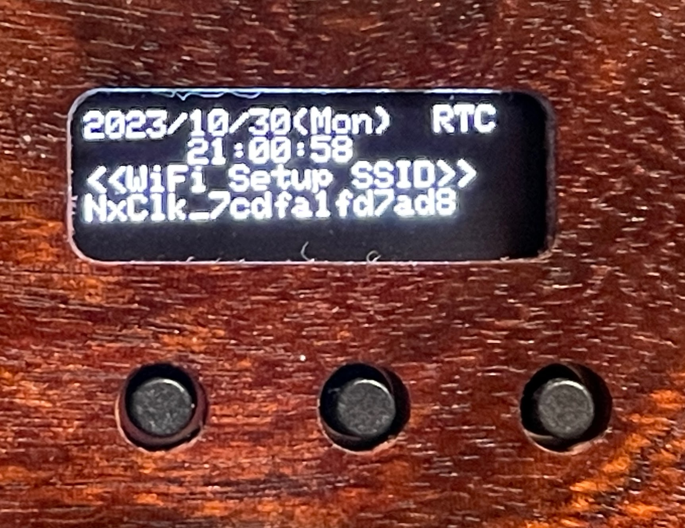
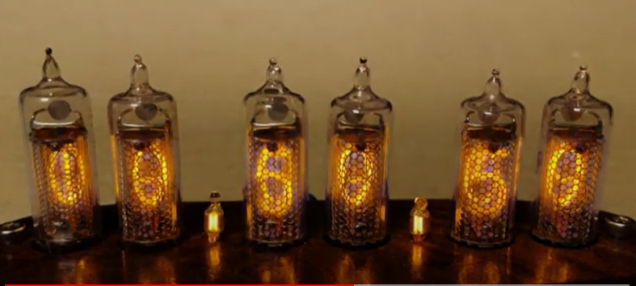
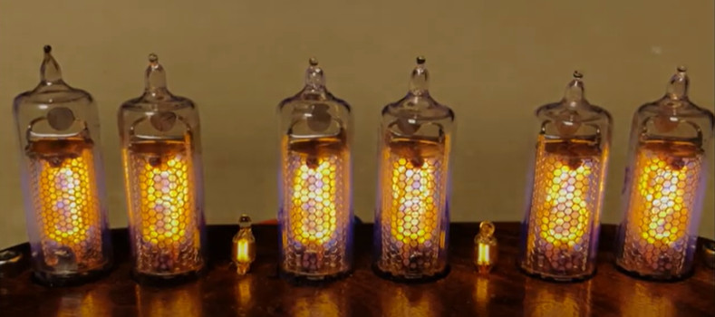
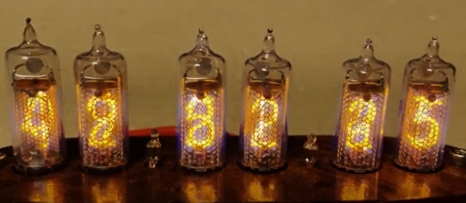

# Nixie Tube Clock

## Buttons

### 時計表示のとき
``` text
+--------+
|  OLED  |
+--------+
  o  o  o
  |  |  |
  |  |  +--- 【Button 0】 [長押し]手動時刻合わせ | [ダブルクリック]エフェクト変更
  |  +------ 【Button 1】 日付表示 | [長押し]時:分:秒 <-> 日:時:分
  +--------- 【Button 2】 明るさ変更
```

### 手動時刻合わせ
``` text
+--------+
|  OLED  |
+--------+
  o  o  o
  |  |  |
  |  |  +--- 【Button 0】 [長押し]キャンセル(時刻表示に戻る)
  |  +------ 【Button 1】 年>月>日>時>分>秒(10秒単位)>確定
  +--------- 【Button 2】 カウントアップ

```

## OLED

### OLED: NTP


### OLED: RTC


## Effects

### Crossfade
[](https://youtu.be/TvNmbtA_Buw?si=GQT42kCDqJkb_wn9)

### Fog
[](https://youtu.be/mSKaQIv3eQ8?si=7f47oo0_3DHgH0Qz)

### Shuffle
[](https://youtu.be/e5-Y6pX2xRI?si=2QsZdDAW-V6RgD0h)

