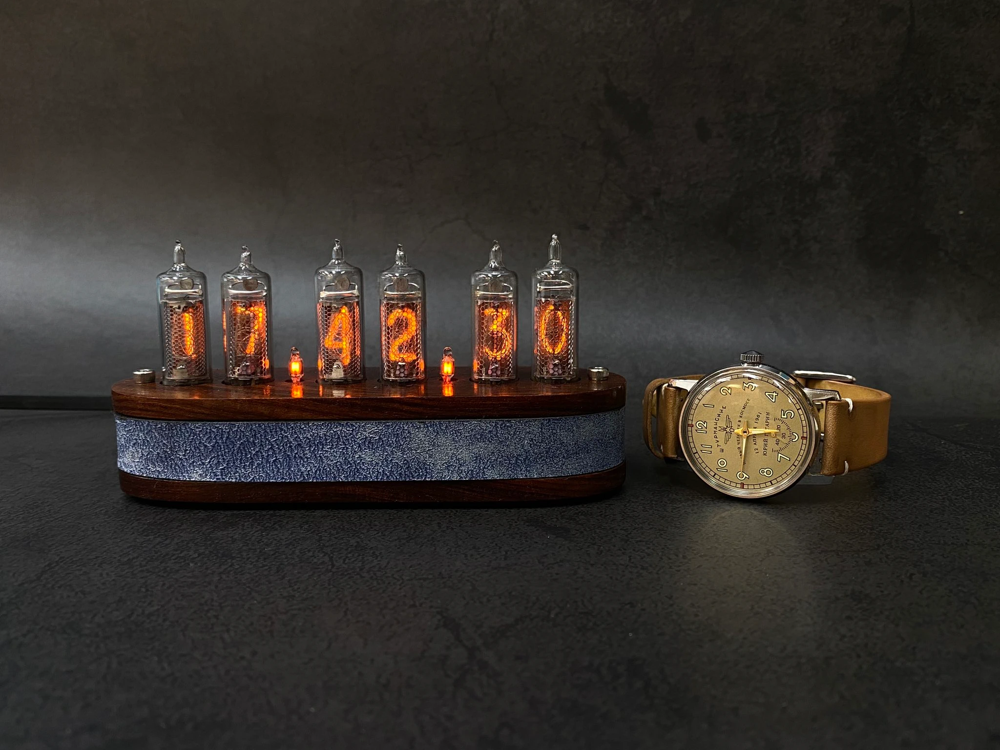
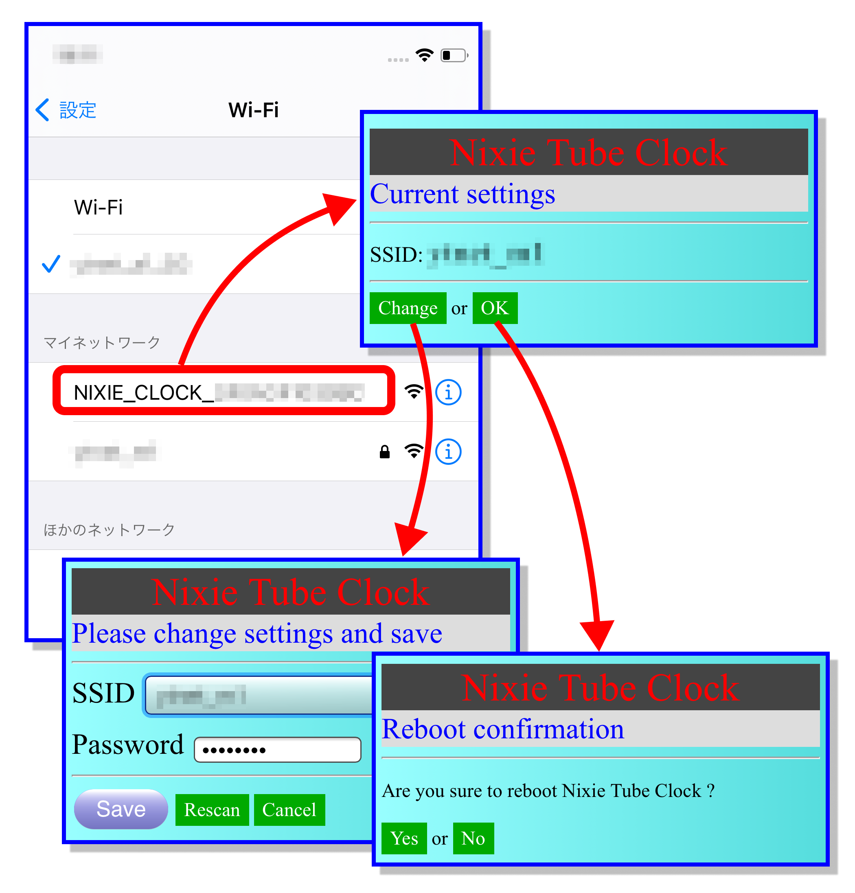

# NixiTubeClock_IN-16



現在入手困難な、本物のニキシー管(IN-16)を使った時計です。

レトロな外観ではありますが、
WiFi経由でインターネット上の時刻サーバーから正確な時刻を取得して、
常に正確な時刻を刻みます。

* WiFi経由で、自動的に時刻合わせ

  インターネット上の時刻サーバー(NTPサーバー)から
  正確な時刻を取得するので、時刻合わせが不要です。
  
  WiFi設定は、スマホで行います。
  (WiFi環境がない場合は、マニュアルで時刻設定することもできます。)

* 明るさの調節

  暗い部屋で眩しいときは、明るさを調整できます。

* 日付表示可能


## 1. 操作法

### 1.1. ボタン概要

時計表示のとき
```
   +---------- [ボタン2] 明るさ変更 | ダブルクリック:バクライトON/OFF(6桁モデル)
   |  +------- [ボタン1] 日付表示
   |  |  +---- [ボタン0] 日付表示 | ダブルクリック:WiFi設定 | 長押し:手動時刻合わせ
   |  |  |
 --v--v--v--
|  o  o  o  |
 -----------
```

手動で時刻を合わせるとき
```
   +---------- [ボタン2] カウントアップ
   |  +------- [ボタン1] 年 -> 月 -> 日 -> 時 -> 分 -> [確定]
   |  |  +---- [ボタン0] 長押し: 時刻合わせキャンセル
   |  |  |
 --v--v--v--
|  o  o  o  |
 -----------
```

### 1.2 日付表示 [ボタン1]

[ボタン1]を押すと、「年/月/日」を表示します。

数秒後に、時刻表示に戻ります。


### 1.3 明るさ変更 [ボタン2]

明るさを変更(サイクリック)


### 1.4. 時刻合わせ

#### 1.4.1 時刻合わせ (WiFi環境がある場合)

WiFi経由でインターネットに接続すれば、
NTP(Network Time Protocol)を使って、
インターネットから正確な時刻を取得して、
自動的に時刻合わせを行います。

設定したWiFiアクセスポイントの情報は、電源を切っても保存されるので、
毎回設定する必要はありません。

1. [ボタン0] を ダブルクリックしてください。

2. アクセスポイント・モードになり、コロンが点灯します。

3. スマホのWiFi設定で、「NIXIE_CLOCK_XXXXXXXX」に接続してください。

4. 接続すると、ブラウザが自動起動されます。

5. SSIDを設定し、保存してください。

6. [OK]で、時計が再起動再起動します。

7. スマホのWiFi設定を元に戻してください。




#### 1.4.2 時刻合わせ (手動)

RTC(Real Time Clock)が、バッテリーでバックアップされているので、
電源を入れ直しても、時刻合わせをし直す必要はありません。

1. [ボタン0] を 長押しして、時刻設定モードに移行

   年:月:日 の表示になり、年(下二桁)が点滅します。

2. 以下

   年 > 月 > 日 > 時 > 分 > [確定]
    
   の順番で設定します。
   (秒は、常に「00」)
   
2. [ボタン2] で 点滅している数値がカウントアップ

3. [ボタン1] で 数値が確定し、次に進みます。

4. 「分」を確定すると、
   時刻が設定され、
   時計表示に戻ります。
   
5. 設定を中断したい場合は、
   [ボタン0] を長押ししてください。

   (元の時刻に戻ります)

(WiFi経由でインターネットに接続している場合は、
この手順で時刻を変更しても、
定期的にインターネットから時刻を取得して補正されます。)

---

## 9. for Developers

### 9.1 ArduinoIDE 設定

#### 9.1.1 ボードマネージャーの設定

[ファイル]-[設定]-[追加のボードマネージャのURL]
```
https://raw.githubusercontent.com/espressif/arduino-esp32/gh-pages/package_esp32_index.json
```

#### 9.1.2 ボード設定

ボード: ESP32S3 dev module
``` text
*USB CDC On Boot: Enabled
 CPU Frequencdy: 240MHz(WiFi)
*Core Debug Level: Info
 USB DFU On Boot: Disabled
 Erase All Flash Befor Sketch Upload: Disabled
 Events Run On: Core 1
 Flash Mode: QIO 80MHz
 Flash Size: 4MB(32Mg)
 JTAG Adapter: Disabled
 Arduino Runs On: Core1
 USB Firmware MSC On Boot: Disabled
 Partition Scheme: Default 4MB with spiffs(1.2MB APP/1.5MB SPIFFS)
 PSRAM: Disabled
 Upload Mode: UART0/Hardware CDC
*Upload Speed: 921600
 USB Mode: Hardware CDC and JTAG
```

### 9.2 [BOOT],[RST]

[BOOT]を押しながら、[RST]をクリック
→ DFU(Device Firmware Update) mode

### 9.3 PINS

```
constexpr int PIN_SDA = 8;
constexpr int PIN_SCL = 9;

constexpr int PIN_BTN_UP = 18;
constexpr int PIN_BTN_DOWN = 17;
constexpr int PIN_BTN_MODE = 14;
```
