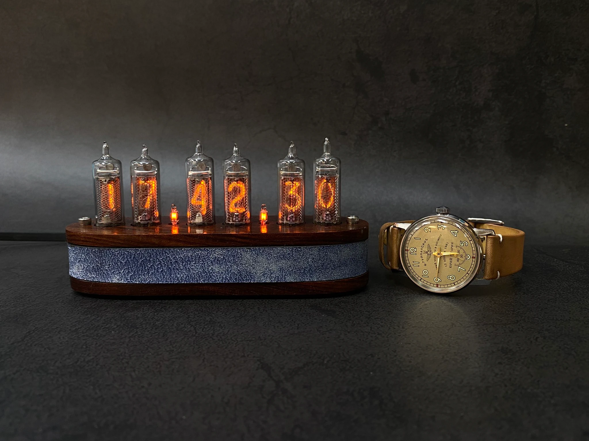
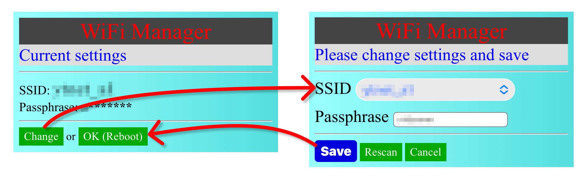
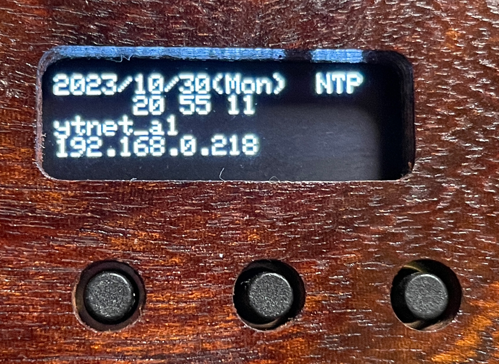
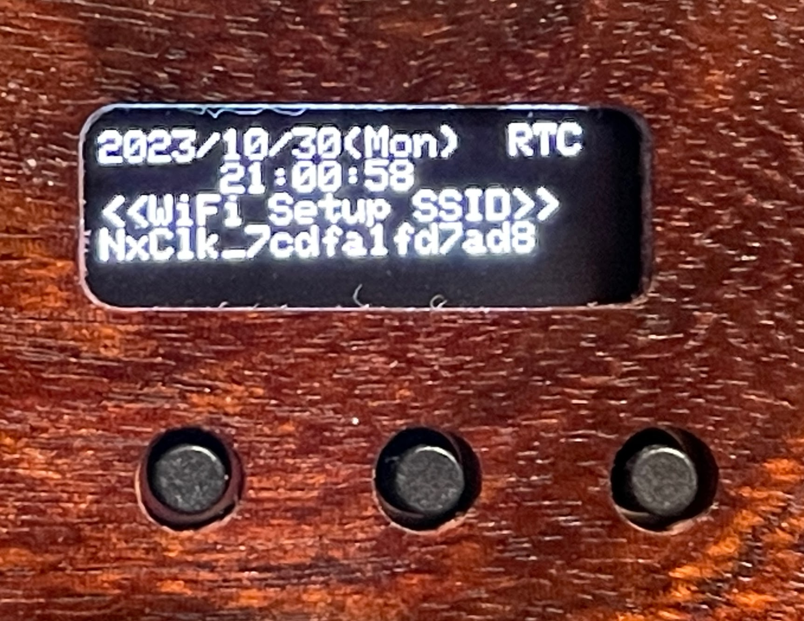
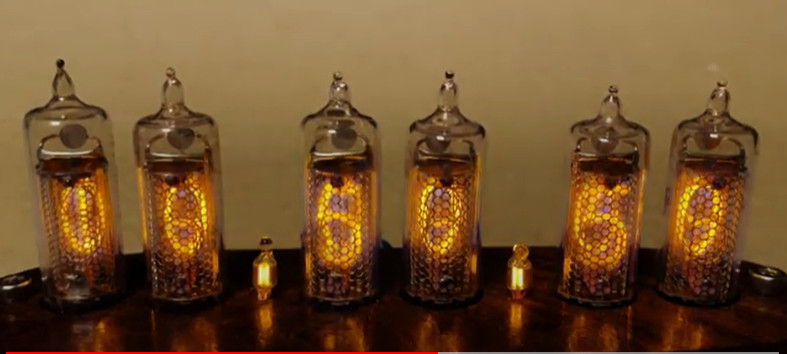
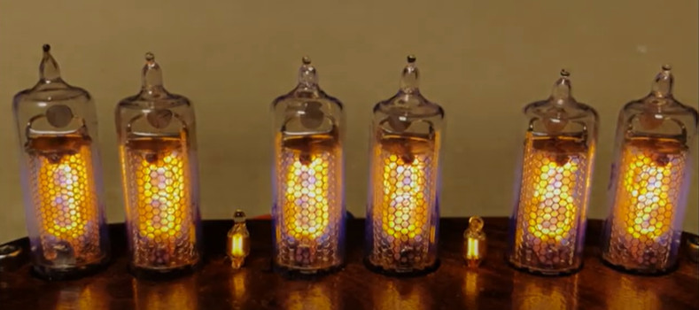
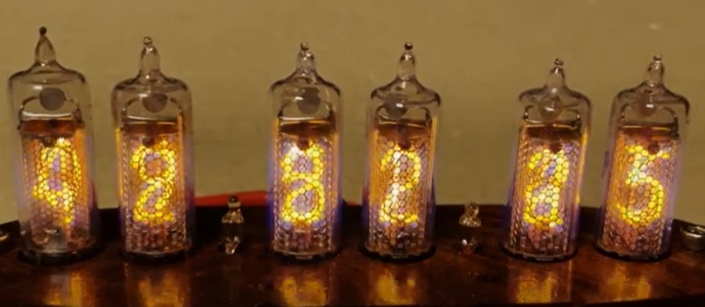

# Nixie Tube Clock: IN-16



本物のニキシー管 IN-16 を使った置き時計です。
レトロな外界ですが、WiFi対応、OLED表示、エフェクトの切り替えなどの機能があります。

## ◆ 特徴

- WiFi対応で、インターネット(NTP)から常に正確な時刻を取得し、自動で時刻合わせします。
- WiFiの設定は、スマートフォンから行います。
- WiFiが使えないところでも、内部時計がバッテリーでバックアップされています。
- 底面に OLEDディスプレイがあり、WiFiの状態などを表示します。
- ニキシー管ならではのエフェクトを切り替えることができます。
  (クロスフェード、フォグ(霧)、シャッフル)

## ◆ ボタン操作

### 時計表示のとき
``` text
+--------+
|  OLED  |
+--------+
  o  o  o
  |  |  |
  |  |  +--- 【Button 0】 [長押し]手動時刻合わせ | [ダブルクリック]エフェクト変更
  |  +------ 【Button 1】 日付表示 | [長押し]時:分:秒 <-> 日:時:分
  +--------- 【Button 2】 明るさ変更
```

### 手動時刻合わせ
``` text
+--------+
|  OLED  |
+--------+
  o  o  o
  |  |  |
  |  |  +--- 【Button 0】 年>月>日>時>分>秒(10秒単位)>確定
  |  |                   [長押し]キャンセル(時刻表示に戻る)
  |  +------ 【Button 1】 カウントアップ
  +--------- 【Button 2】 カウントダウン
```

### 

- Reboot: [Button 0] + [Button 2]
- エフェクトの全桁表示切り替え: [Button 2]ダブルクリック


## ◆ WiFi 設定

スマートフォンで、一旦、本時計に接続して、WiFiの設定を行います。




## OLED表示

### NTP


### OLED: RTC


## Effects

### Crossfade
[](https://youtu.be/TvNmbtA_Buw?si=GQT42kCDqJkb_wn9)

### Fog
[](https://youtu.be/mSKaQIv3eQ8?si=7f47oo0_3DHgH0Qz)

### Shuffle
[](https://youtu.be/e5-Y6pX2xRI?si=2QsZdDAW-V6RgD0h)
